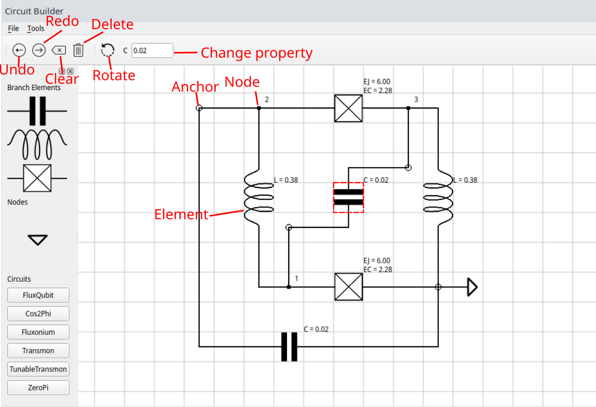

# Superconducting Circuit Builder
This is a GUI for designing superconducting circuits in the lumped-element limit intended to accompany the Python package scQubits.

## Installation
`pip install sccircuitbuilder`

## Usage
Run `import sccircuitbuilder as sc`, then `sc.GUI()`. The elements used to build a circuit are
1) Capacitor
2) Inductor
3) Josephson Junction

Drag the icons from the toolbox onto the canvas to place down an element. Drag nodes together to connect them. Left-click on wires to add anchor points and drag 
the anchor points to guide the wires. Export the circuit to scqubits to diagonalize and simulate the circuit!

### Keyboard
* `Shift + Right Click` - add to selection
* `Shift + Right Drag` - add box to selection
* `Enter` on property entry box - change property

### Mouse
* `Left Button Drag` on whitespace - pan
* `Scroll Wheel` - zoom
* `Left Button Drag` on element/selected group - move selection
* `Right Button Drag` - box selection
* `Left Button Click` on element - rotate
* `Right Button Click` on element - select and show properties

## Features
* Split (reverse-join) nodes
* Delete elements
* Wire anchor points
* Undo / Redo
* Save / Open
* Export to scQubits circuit format
* Pre-made circuit library

## Future plans
* Offset charge / external flux
* Further integration with scqubits
* Accompanying tutorials

## Known issues
* Right click has no activation distance, so using a mouse will result in some dropped right clicks
* Sometime import/undo/redo (the memento-based functionalities) crash, but usually they seem to work 
* File save is not very inteligent and adds `.circuit` to the end of the filename regardless of whether it is already there
